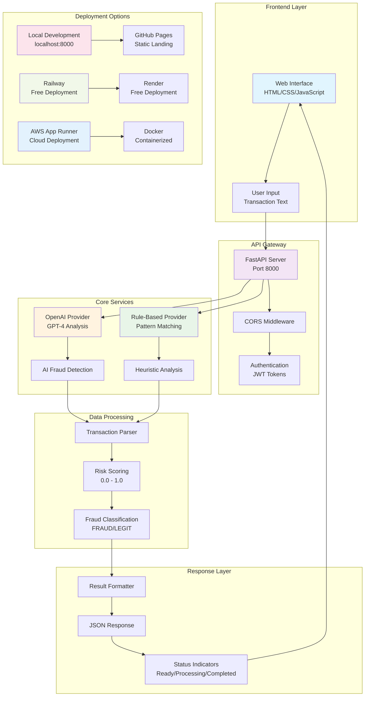
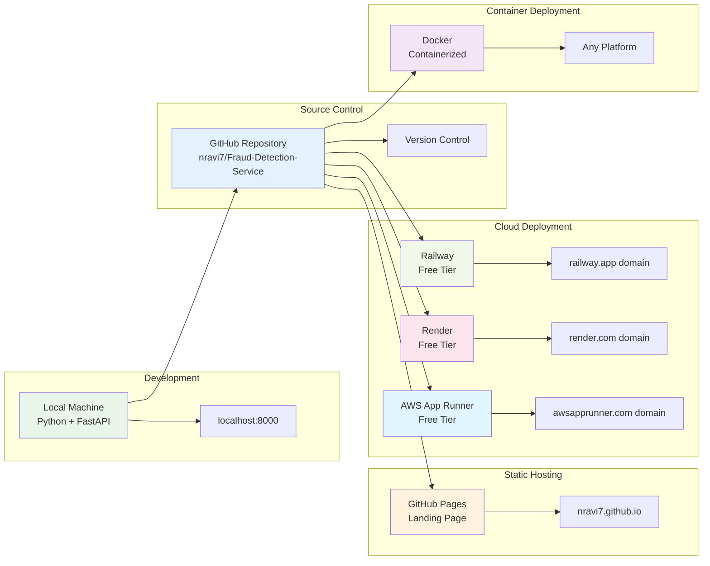
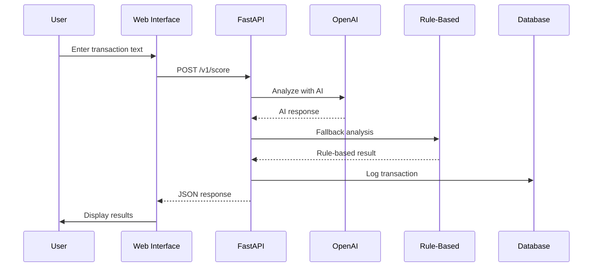

# 🏗️ Fraud Detection Service Architecture

## System Architecture Overview

## 🎯 Component Details

### **Frontend Layer**
- **Web Interface**: Modern, responsive HTML/CSS/JavaScript
- **User Experience**: Real-time status indicators and example transactions
- **Design**: Professional gradient design with Font Awesome icons

### **API Gateway**
- **FastAPI Server**: High-performance Python web framework
- **CORS Middleware**: Cross-origin resource sharing for web access
- **Authentication**: JWT-based security (optional for demo)

### **Core Services**
- **OpenAI Provider**: AI-powered fraud detection using GPT-4
- **Rule-Based Provider**: Pattern matching for fraud indicators
- **Fallback System**: Works without API keys using demo mode

### **Data Processing**
- **Transaction Parser**: Analyzes transaction text for fraud patterns
- **Risk Scoring**: Generates confidence scores from 0.0 to 1.0
- **Classification**: Determines FRAUD or LEGIT status

### **Response Layer**
- **Result Formatter**: Structures response data
- **Status System**: Real-time processing indicators
- **Error Handling**: Graceful error management

## 🚀 Deployment Architecture

## 🔧 Technology Stack

### **Backend**
- **FastAPI**: Modern Python web framework
- **Uvicorn**: ASGI server for production
- **Pydantic**: Data validation and serialization
- **OpenAI API**: AI-powered fraud detection
- **Python 3.9+**: Runtime environment

### **Frontend**
- **HTML5**: Semantic markup
- **CSS3**: Modern styling with gradients
- **JavaScript ES6+**: Interactive functionality
- **Font Awesome**: Professional icons
- **Responsive Design**: Mobile-friendly interface

### **Deployment**
- **GitHub**: Source code repository
- **GitHub Pages**: Static site hosting
- **Railway**: Free cloud deployment
- **Render**: Alternative cloud platform
- **AWS App Runner**: Enterprise cloud deployment
- **Docker**: Containerization

## 📊 Data Flow

## 🛡️ Security Features

- **Input Validation**: Pydantic models for data validation
- **CORS Protection**: Cross-origin request handling
- **Error Handling**: Graceful error management
- **Rate Limiting**: Built-in FastAPI protection
- **Environment Variables**: Secure API key management

## 📈 Performance Features

- **Async Processing**: FastAPI async/await support
- **Response Caching**: Efficient data handling
- **Status Indicators**: Real-time user feedback
- **Error Recovery**: Fallback mechanisms
- **Scalable Architecture**: Cloud-ready design

## 🎯 Key Benefits

- ✅ **AI-Powered**: Advanced fraud detection
- ✅ **Rule-Based Fallback**: Works without API keys
- ✅ **Multiple Deployment**: Various hosting options
- ✅ **Professional UI**: Modern, responsive design
- ✅ **Easy Setup**: Simple installation process
- ✅ **Portfolio Ready**: Perfect for showcasing skills

---

**Built with ❤️ by Ravi N using modern web technologies**
