# 🛡️ Fraud Detection Service

[](https://python.org)
[](https://fastapi.tiangolo.com)
[](https://openai.com)
[](LICENSE)
[](https://nravi7.github.io/Fraud-Detection-Service-with-AI-powered-analysis-and-web-interface/)

A simple AI-powered fraud detection service that analyzes transactions for suspicious activity using OpenAI and rule-based detection.

## 🏗️ Architecture Overview

```mermaid
graph TB
    subgraph "Frontend Layer"
        A["🌐 Web Interface<br/>HTML/CSS/JavaScript"] --> B["📝 User Input<br/>Transaction Text"]
    end
    
    subgraph "API Gateway"
        C["⚡ FastAPI Server<br/>Port 8000"] --> D["🔒 CORS Middleware"]
    end
    
    subgraph "Core Services"
        F["🤖 OpenAI Provider<br/>GPT-4 Analysis"] --> G["🧠 AI Fraud Detection"]
        H["📊 Rule-Based Provider<br/>Pattern Matching"] --> I["🔍 Heuristic Analysis"]
    end
    
    subgraph "Data Processing"
        J["⚙️ Transaction Parser"] --> K["📈 Risk Scoring<br/>0.0 - 1.0"]
        K --> L["🏷️ Fraud Classification<br/>FRAUD/LEGIT"]
    end
    
    subgraph "Response Layer"
        M["📋 Result Formatter"] --> N["📄 JSON Response"]
        N --> O["📊 Status Indicators<br/>Ready/Processing/Completed"]
    end
    
    B --> C
    C --> F
    C --> H
    G --> J
    I --> J
    L --> M
    O --> A
    
    style A fill:#e1f5fe
    style C fill:#f3e5f5
    style F fill:#fff3e0
    style H fill:#e8f5e8
```



## 🚀 Deployment Architecture


## 🔧 Technology Stack


## 📊 Data Flow

```mermaid
sequenceDiagram
    participant U as 👤 User
    participant W as 🌐 Web Interface
    participant F as ⚡ FastAPI
    participant O as 🤖 OpenAI
    participant R as 📊 Rule-Based
    
    U->>W: Enter transaction text
    W->>F: POST /v1/score
    F->>O: Analyze with AI
    O-->>F: AI response
    F->>R: Fallback analysis
    R-->>F: Rule-based result
    F-->>W: JSON response
    W->>U: Display results
```



## 🚀 Quick Start

### 1. Clone the Repository
```bash
git clone https://github.com/yourusername/fraud-service-python.git
cd fraud-service-python
```

### 2. Install Dependencies
```bash
pip install -r requirements.txt
```

### 3. Run the Application
```bash
python start.py
```

### 4. Open in Browser
Go to: `http://localhost:8000`

## 🎯 How to Use

1. **Enter a transaction** in the text box
2. **Click example buttons** to try pre-built examples
3. **Click "Analyze"** to get fraud detection results
4. **View results** with fraud score and risk level

## 🔧 Features

- **AI Analysis**: Uses OpenAI GPT for intelligent fraud detection
- **Rule-Based Detection**: Works without API keys using pattern matching
- **Web Interface**: Beautiful, responsive design
- **Real-Time Results**: Instant fraud scoring
- **Example Transactions**: Pre-built test cases

## 🔑 Optional: OpenAI API Key

For enhanced AI analysis, set your OpenAI API key:

**Windows:**
```bash
set OPENAI_API_KEY=your-api-key-here
python start.py
```

**Linux/Mac:**
```bash
export OPENAI_API_KEY=your-api-key-here
python start.py
```

**Get API Key:** [OpenAI Platform](https://platform.openai.com/api-keys)

## 📊 Example Transactions

- **Normal**: "User u99 spent $129.99 at local store" → LEGIT
- **Suspicious**: "User u99 made urgent wire transfer of $5000 at 3am" → FRAUD
- **High-Risk**: "User u99 purchased bitcoin worth $2000" → FRAUD

## 🌐 API Endpoints

- `GET /` - Web interface
- `GET /health` - Health check
- `POST /v1/score` - OpenAI analysis
- `POST /v1/score/hf` - Rule-based analysis
- `GET /docs` - API documentation

## 🚀 Deployment Options

### Heroku
1. Create `Procfile`:
```
web: uvicorn app.main:app --host 0.0.0.0 --port $PORT
```
2. Deploy to Heroku

### Docker
1. Create `Dockerfile`:
```dockerfile
FROM python:3.9
WORKDIR /app
COPY requirements.txt .
RUN pip install -r requirements.txt
COPY . .
CMD ["uvicorn", "app.main:app", "--host", "0.0.0.0", "--port", "8000"]
```
2. Build and run:
```bash
docker build -t fraud-detection .
docker run -p 8000:8000 fraud-detection
```

### VPS/Cloud
```bash
pip install -r requirements.txt
uvicorn app.main:app --host 0.0.0.0 --port 8000
```

## 📁 Project Structure

```
fraud-service-python/
├── app/
│   ├── main.py              # FastAPI application
│   ├── schemas.py           # Data models
│   └── providers/
│       ├── openai_provider.py    # OpenAI integration
│       └── hf_provider.py        # Rule-based detection
├── static/
│   ├── index.html           # Web interface
│   ├── style.css            # Styling
│   └── script.js            # Frontend logic
├── requirements.txt         # Dependencies
├── start.py                 # Easy startup script
└── README.md               # This file
```

## 🛠️ Requirements

- Python 3.7+
- FastAPI
- Uvicorn
- OpenAI API key (optional)

## 📝 License

MIT License - feel free to use this project for learning and development!

## 📄 Copyright

© 2024 Ravi N. All rights reserved.

Built with ❤️ using FastAPI, OpenAI, and modern web technologies.

---

**Ready to detect fraud? Start the service and analyze your first transaction!** 🚀